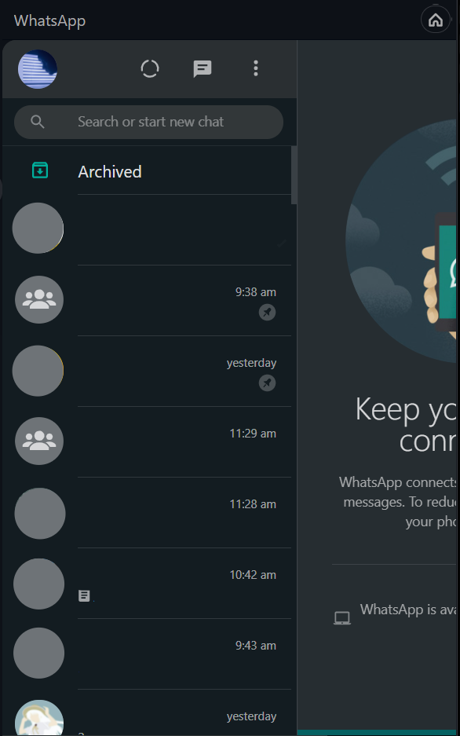
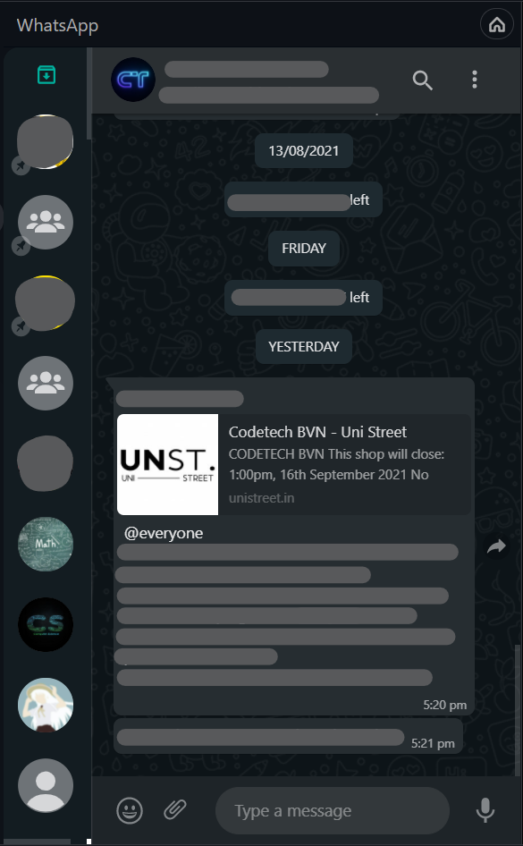
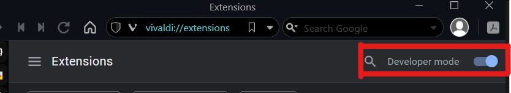
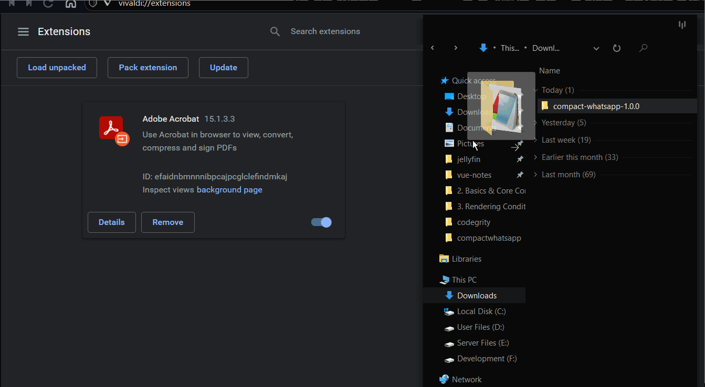
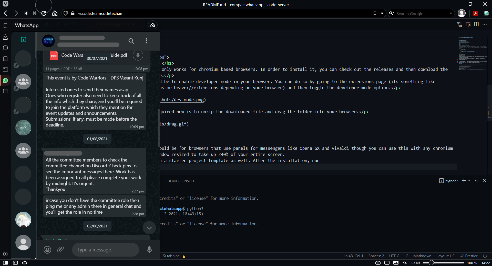

<h1 align="center">
  
</h1>

<h4 align="center">⚙ Compact layout for whatapp web</h4>

  <a href="#about">About</a> | 
  <a href="#installation">Installation</a> | 
  <!-- <a href="#usage">Usage</a> | 
  <a href="#features">Features</a> | 
  <a href="#contributors">Contributors</a> |
  <a href="#license">License</a> -->

 

# About

> **Next**: [Installation](#installation)

Have you ever had trouble with whatsapp web in terms of multitasking? Well I did, and it was pretty annoying whenever I wanted to multitask and tile it to a smaller portion of the screen. It is not responsive at all which what compactwhatsapp tries to fix.

<table>
    <tr>
        <th>Default Layout
        <th>Compact Whatsapp
    </tr>
    <tr>
        <td>
        <td>
    <tr>
</table>

  <h1> Installation </h1>
  
Currently this only works for chromium based browsers. In order to install it, you can check out the releases and then download the zip provided there.

  
Next step would be to enable developer mode in your browser. You can do so by going to the extensions page (its something like chrome://extensions or brave://extensions depending on your browser) and then toggle the developer mode option.

  

  
All that is required now is to unzip the downloaded file and drag the folder into your browser.

  

# Usage
The best use case would be for browsers that use panels for messengers like Opera GX and vivaldi though you can use this with any chromium browser with the window resized to take up <40% of your entire screen.
Hyper CLI comes with a starter project template as well. After the installation, run 

# Contributors
<!-- > For contirbuting, see [CONTRIBUTING.md](https://github.com/serumstudio/hype/tree/main/CONTRIBUTING.md) -->

Thanks to these contributors who made the project maintained!

|    |
|:-------------------------------------------:|
| [sortedcord](https://www.github.com/sortedcord)     |

  <h1> License </h1>
  
 CompactWhatsapp is license under <a href="https://github.com/sortedcord/compactwhatsapp/blob/master/LICENSE">MIT</a> 

